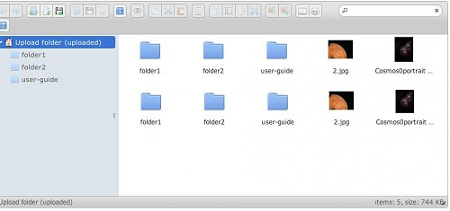

# yaknetCloudDepolama
## C# ile yapılmış Google Cloud gibi Bulut Sistemi

Bu programda online bulut hizmeti ile kuullanıcıların dosyalarını internette depolaması amaçlanmaktadır.

Kullanılanlar : 

Client : C# + HTML5 + JQUERY + Elfinder(Jquery Dosya Listeleme Framework) + PHP

